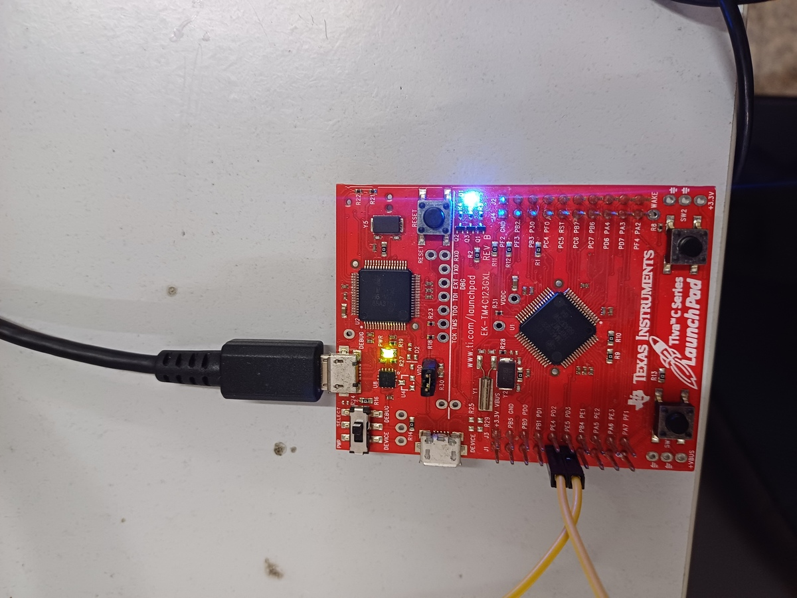

# Embedded Systems Lab Report

<!-- Insert your details here -->
* Divya Sharma [ee23mt005@iitdh.ac.in] 
* Shweta Totla [200030053@iitdh.ac.in]
* Group: 02  
* [11-10-2023]

### Problem Statement:
Program your microcontroller to transmit:  

"F0" if SW1 is pressed  

"AA" if SW2 is pressed  

over UART with baud rate 9600 and odd parity.  

Your program should also listen for incoming data on the UART with the same baud and parity config; if "AA" is received LED should be GREEN; if "F0" is recieved, the LED should be BLUE and if any error is detected LED should be RED. Test this by communicating with your neighboring group.  

### Solution Summary:

First a UART module (here module 5) is configured with baud rate 9600 and odd parity.  
For UART transmission, whenever any of the switches is pressed, an interrupt is generated and the corresponding interrupt handler transmits 0xF0 if SW1 is pressed and 0xAA if SW2 is pressed.  
For UART reception, whenever a data is received on the UART 5 module (which uses GPIO pins PE4 and PE5 for receive and transmit respectively), and interrupt is generated and depending on the the data is, the LED turns on. If "AA" is received LED is GREEN and if "F0" is recieved, the LED is BLUE.  
Also if there are any errors, then the LED turns RED.

### Assumptions, Constraints and Requirements:

* Assuming that PE4 and PE5 are connected to each other for communication. In case of broken connection, an error is detected and the LED turns RED.  
* LEDs use a Read Modify Write (instead of Write), so if f0 is transmitted followed by aa, then the LED would be Green+Blue. To make the LED blue only, a write operation "GPIO_PORTF_DATA_R = BLUE_LED;" instead of "GPIO_PORTF_DATA_R |= BLUE_LED;" can be used.
* Calculations
Bit Rate Division (BRD) Factor Calculation:
BRD = Clock_frequency/(ClkDiv * Baud Rate)
Here ClkDiv = 16 because HSE (High Speed Enable) in UARTCTL is 0 (if it's 1, then ClkDiv=8).
Clock_frequency = System Clock = 16 Mhz
Baud Rate = 9600
BRD = (16 M / 16 * 9600) = 104.1667
IBRD = Integer(104.1667)= 104
FBRD = Integer(Fractional(BRD) * 64 + 0.5) 
FBRD = Integer(0.1667 * 64 + 0.5 ) = 11

### Block diagram / Flowchart:

### Measurements and Results:

The Green LED turns on when AA is received.  

The Blue LED turns on when F0 is received.  

The Red LED turns on when an error occurs during the transmission.  
  

### Discussion and Conclusions:

UART transmits LSB first. When the byte (payload) has an even parity the parity bit (odd parity) is 1 and is 0 when the data byte has odd parity.
